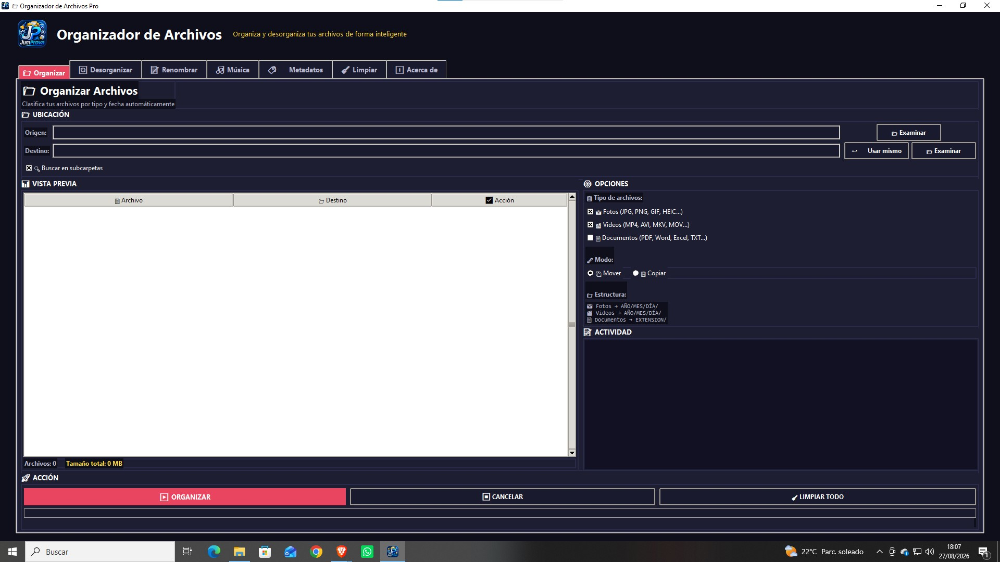
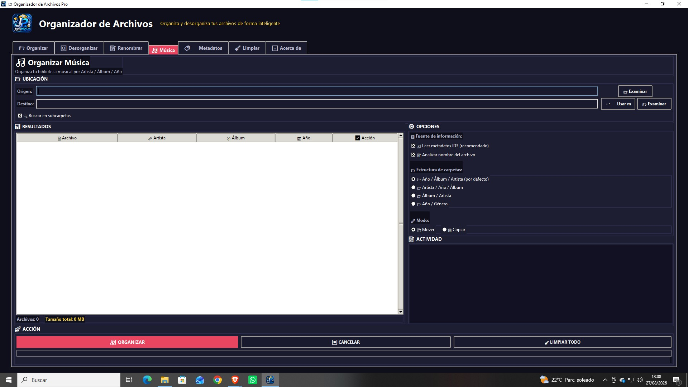
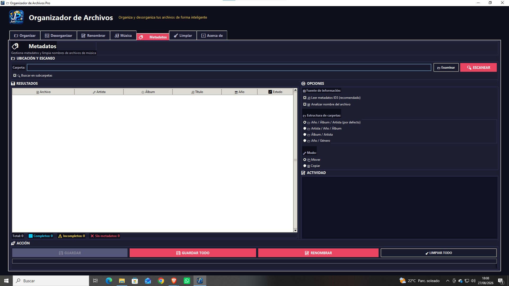
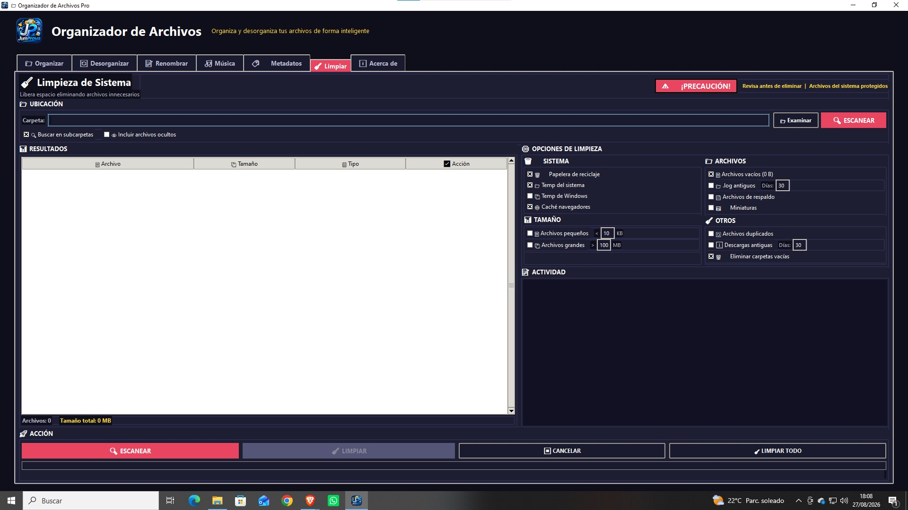
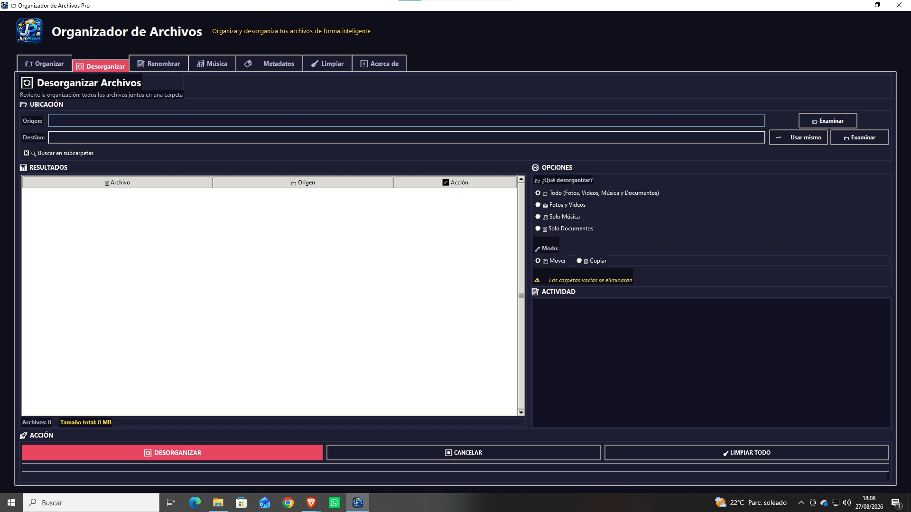
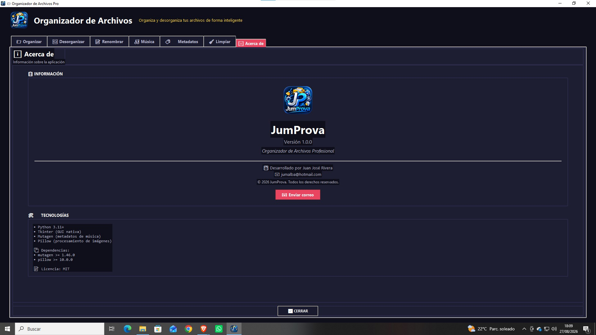

# 🗂️ JumProva

### Professional File Organizer

 
 
 


---

## 📋 Description

**JumProva** is an all-in-one desktop application to organize, clean, and manage your files professionally and easily. Designed for users who want to have **all their files under control**.

---

## 📸 Screenshots

| Organize | Music | Metadata |
|---|---|---|
|  |  |  |

| Rename | Cleaner | Desorganize |
|---|---|---|
|  |  |  |

| About |
|---|
|  |

---

## ✨ Main Features

### 📁 Organize
- 📸 **Photos** → Sorted by `YEAR/MONTH/DAY/`
- 🎬 **Videos** → Sorted by `YEAR/MONTH/DAY/`
- 📄 **Documents** → Sorted by extension (`PDF/`, `DOCX/`, `XLSX/`, etc.)

### 🔄 Desorganize
- Reverse any organization made by the app
- Support for Photos, Videos, Music, and Documents

### 📝 Rename
- Batch renaming with:
  - Prefix / Suffix
  - Auto-numbering
  - Modification date
  - Text replacement
  - Lowercase / Uppercase

### 🎵 Music
- Organized by **Artist / Album / Year**
- ID3 metadata extraction
- Multiple folder structures

### 🏷️ Metadata
- Music file scanning
- Metadata editor
- File name cleaning
- Standard format: `Artist - Title.mp3`

### 🧹 System Cleaner
- 🗑️ Recycle Bin
- 📁 System temporary files
- 🌐 Browser cache
- 🖼️ Thumbnails
- 📄 Empty files (0 B)
- 📄 Small files (< X KB)
- 📦 Large files (> X MB)
- 📁 Old .log files
- 💾 Backup files
- ⬇️ Old downloads
- 🔄 Duplicate files
- 🗑️ Remove empty folders
- 🛡️ **System file protection**

### ℹ️ About
- App information and credits

---

## 🛠️ Technologies Used

- 🐍 **Python 3.11+**
- 🖥️ **Tkinter** (Native GUI)
- 🎵 **Mutagen** (Music metadata)
- 🖼️ **Pillow** (Image processing)

---

## 📦 Installation & Usage

### 🔧 Requirements
- Python 3.11 or higher
- Windows 10/11 (recommended)

### 📥 Install dependencies

```bash
pip install -r requirements.txt

### 🚀 Ejecutar desde código fuente

python src/main.py

### 📦 Compilar a .exe

pyinstaller JumProva.spec --clean

---

## 👨‍💻 Autor

**Juan José Rivera**  
📧 jumalba@hotmail.com  
🐙 github.com/jumalba07-commits

---

## 📅 Versiones

| Versión | Fecha | Cambios |
|---|---|---|
| 1.0.0 | 2026 | Lanzamiento inicial |

---

## 📝 Licencia

Este proyecto está bajo la licencia **MIT**.

---

Hecho con ❤️ por Juan José Rivera
