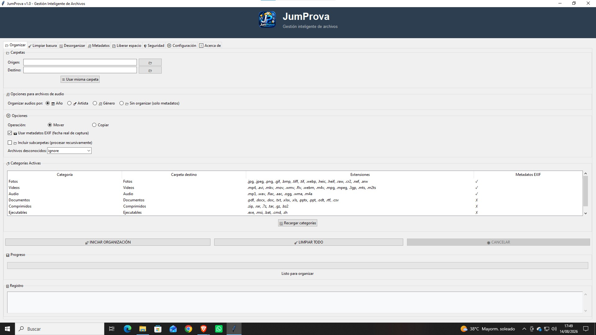
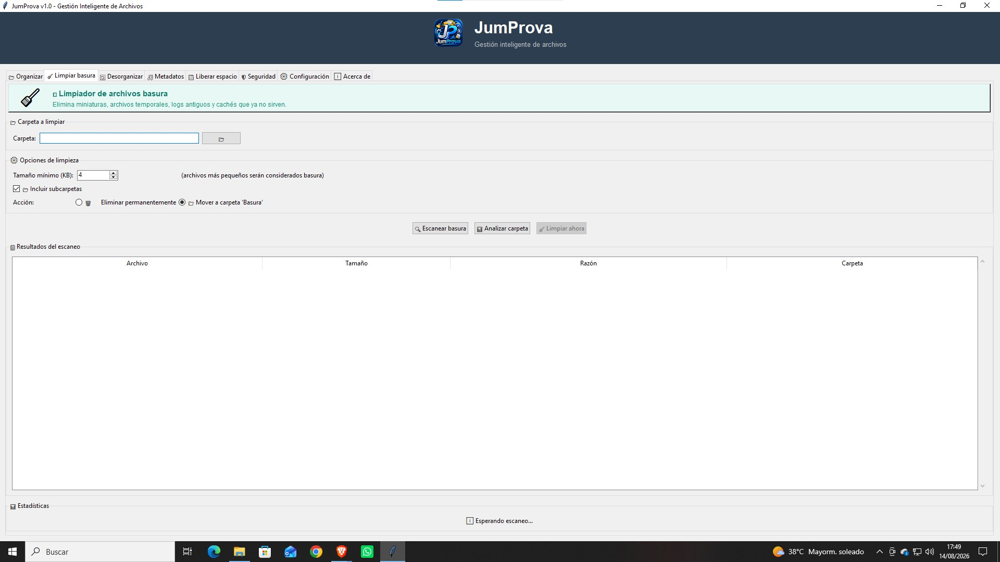
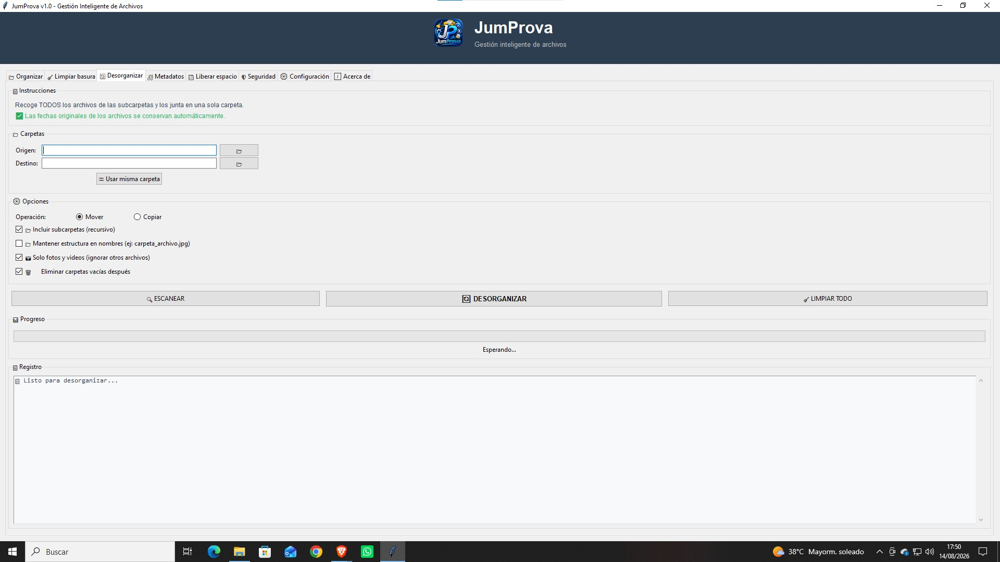
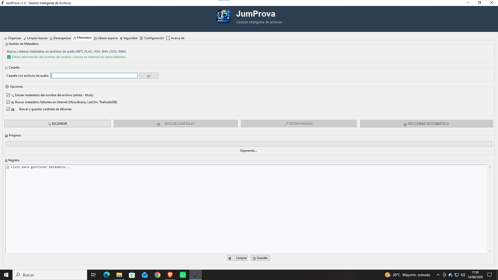
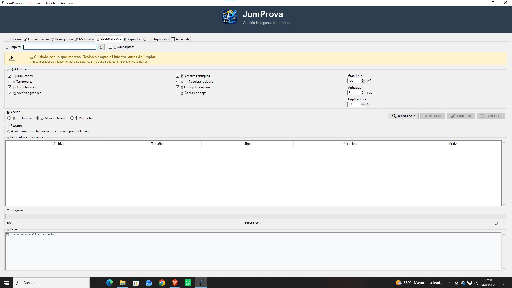
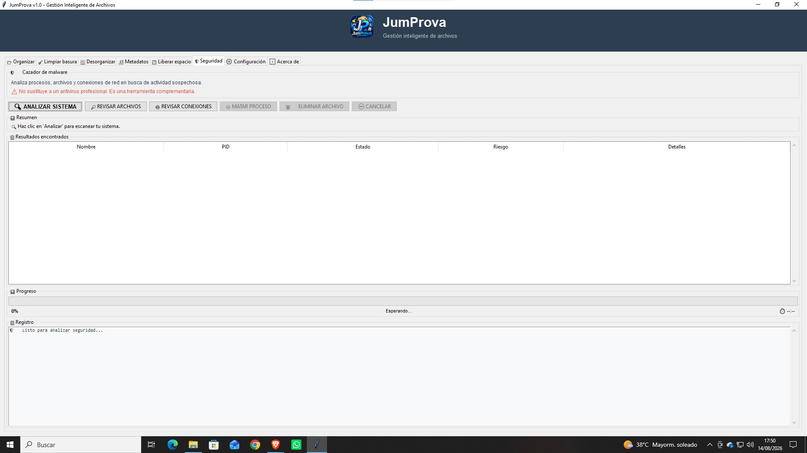
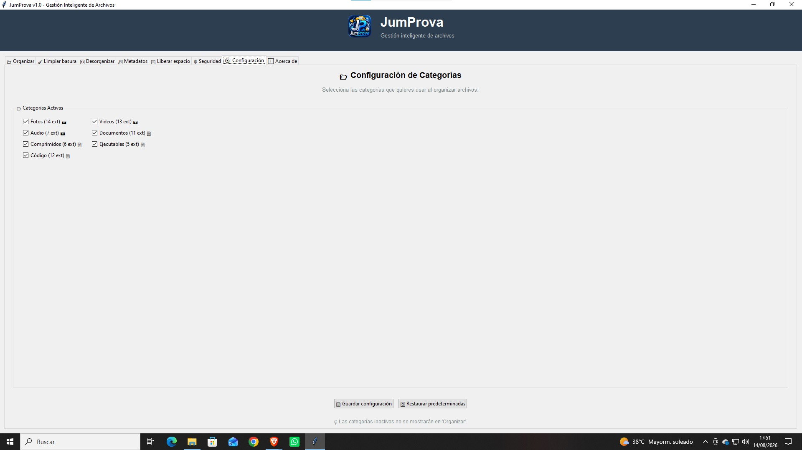

# 📂 JumProva - Organizador Pro

**Gestión inteligente de archivos**


**¡Dale una estrella para apoyar el proyecto!**

[](https://github.com/jumalba07-commits/JumProva)
[](https://github.com/jumalba07-commits/JumProva)

[](https://github.com/jumalba07-commits/JumProva/releases)

🐛 **Reporta errores**: [Issues](https://github.com/jumalba07-commits/JumProva/issues)

💡 **Sugerencias**: Abre un Issue o un Pull Request


---

## 🚀 ¿Qué es JumProva?

JumProva es una aplicación **todo-en-uno** para organizar, limpiar, gestionar metadatos y proteger tu sistema de archivos.
JumProva es un proyecto personal que nace de la necesidad de tener 
una herramienta completa y gratuita para organizar archivos.

El desarrollo ha sido guiado con una visión clara de lo que debía hacer, 
combinando creatividad, diseño y tecnología para ofrecer una experiencia 
intuitiva y funcional.

💡 **Todos los comentarios, sugerencias y contribuciones son bienvenidos.**
---

## ✨ Funcionalidades

| Módulo | Función |
|--------|---------|
| 📂 **Organizar** | Clasifica archivos por tipo, año, mes y día |
| 🧹 **Limpiar basura** | Elimina archivos temporales, miniaturas y basura |
| 🔄 **Desorganizar** | Junta archivos de subcarpetas en una sola carpeta |
| 🎵 **Metadatos** | Gestiona artista, álbum, año, género y carátulas |
| 💾 **Liberar espacio** | Busca duplicados, archivos grandes, logs y cachés |
| 🛡️ **Seguridad** | Analiza procesos, archivos y conexiones en busca de malware |
| ⚙️ **Configuración** | Activa o desactiva categorías según necesidades |

---

## 📸 Capturas de pantalla









---

## ⬇️ Descarga

Puedes descargar la última versión desde la sección [**Releases**](https://github.com/TU_USUARIO/JumProva/releases)

---

## 🔧 Instalación

### Opción 1: Ejecutable (recomendado)

1. Descarga `JumProva.exe` desde [Releases](https://github.com/jumalba07-commits/JumProva/releases)
2. Ejecútalo (no necesita instalación)

### Opción 2: Desde el código fuente

```bash
git clone https://github.com/jumalba07-commits/JumProva.git
cd JumProva
pip install -r requirements.txt
python main.py
